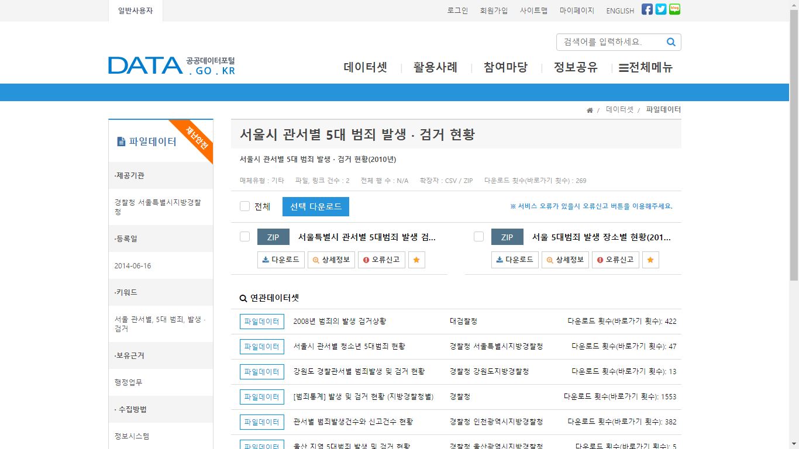
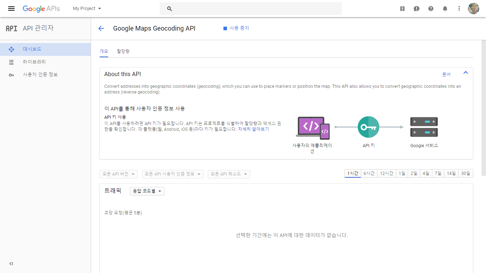
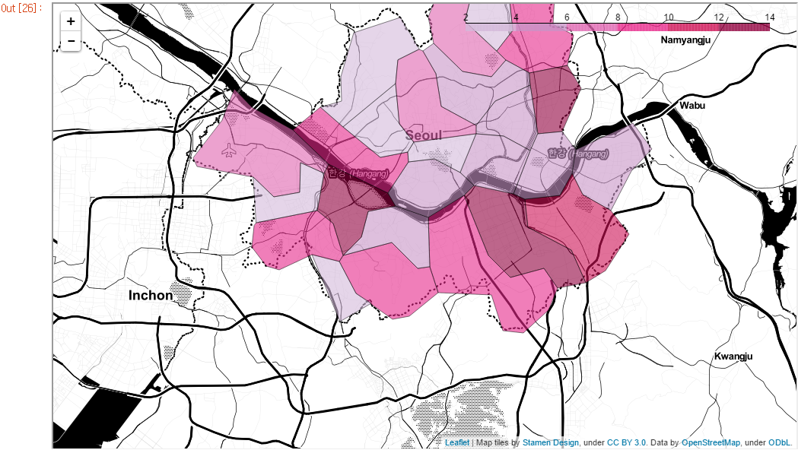
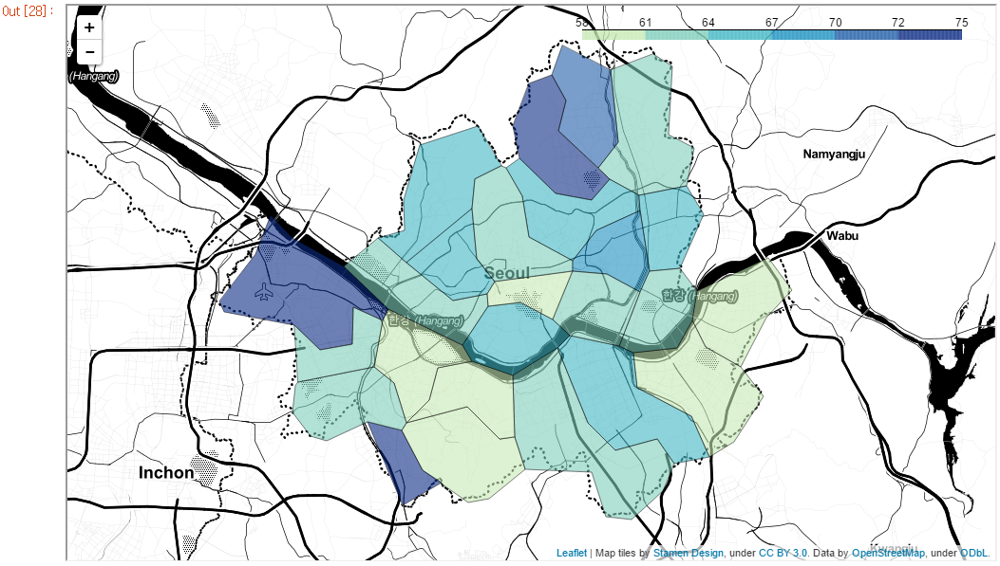
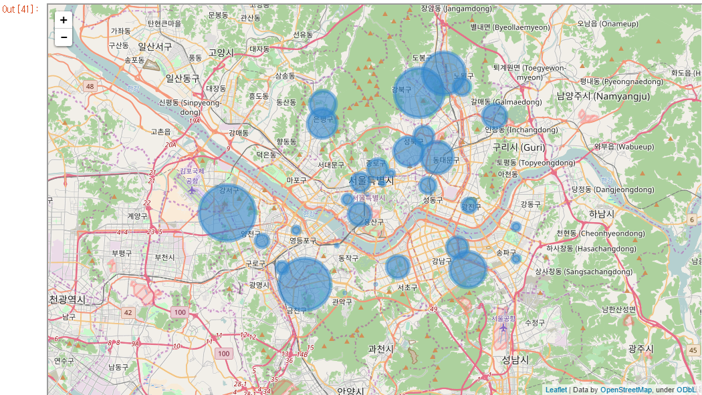

# seoul_crime
프로젝트의 상세한 기술은 jupyter notebook 파일에 markdown으로 작성하였습니다.

### 아래 링크를 클릭해주세요
[Seoul_crime_analysis_link](https://github.com/HyunSu-Jin/seoul_crime/blob/master/seoul_crime.ipynb)

## 정부 3.0 공공 데이터 ( http://data.go.kr )

서울시 관서별 5대 범죄 현황 데이터를 통해 서울시 각 지역별 범죄현황을 분석하고 데이터를 시각화 하여 유의미한 결과를 도출한다.

## Google maps

기관의 이름이나 지역 이름으로 위도,경도와 같은 데이터를 얻거나 위도,경도 데이터로 해당 지역의 정보를 얻을 수 있다.

위 공공데이터 및 Google API를 이용해 데이터 분석 및 시각화를 수행

### 아래 링크를 클릭해주세요
[Seoul_crime_analysis_link](https://github.com/HyunSu-Jin/seoul_crime/blob/master/seoul_crime.ipynb)

## Data Visualizaton 
(jupyter 파일 내 folium,googlemaps에 대해 github에서 제공하지않음)

- 서울시 각 구별 살인 횟수 

- 서울시 각 구별 검거율 

- 서울시 각 구별 살인 & 경찰서별 검거율 

